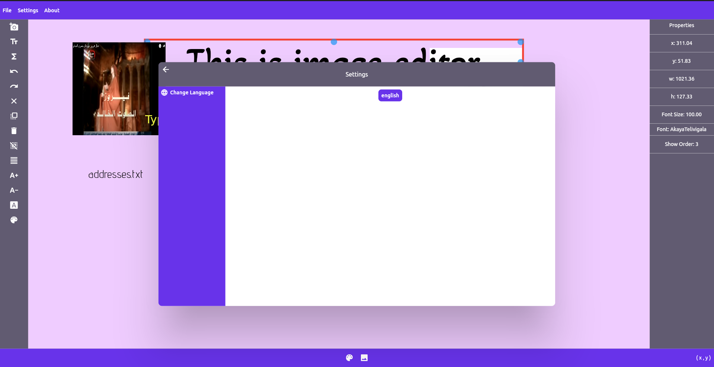

# photo_editor

Photo editor app that can edit images in single mode or batch mode. Made using flutter.

The main feature of this app is generating images based on texts from source files. For example, if you have a template image with some placeholder text, then you can use this app to replace the placeholder text with text from a source file, and generate one image for each replaced line of text from that text file. See the video demo below for a visual representation of the app.

# Using the app:

You can download the app from:
- Snap store: https://snapcraft.io/batch-image-editor
- Windows store (soon)
- Directly get the executable for linux, you can find it in `releases/linux/bundle.zip` in this repo. When you unzip the file, you can find the executable as `photo_editor`.
- Directly get the executable for windows, you can find it in `releases/windows/Release.zip` in this repo. When you unzip the file, you can find the executable as `photo_editor.exe`.
## some screenshots:

## Video Tutorial
https://user-images.githubusercontent.com/49842031/189867344-cca75f07-7789-40a7-bd9d-c93ecd0ac3dc.mp4

# Contributing
- If you want to contribute you are welcome to make a pull request :)
- You can also join the [discord server](https://discord.gg/m8h3ZBEp) of the app where we can talk about features and progress.